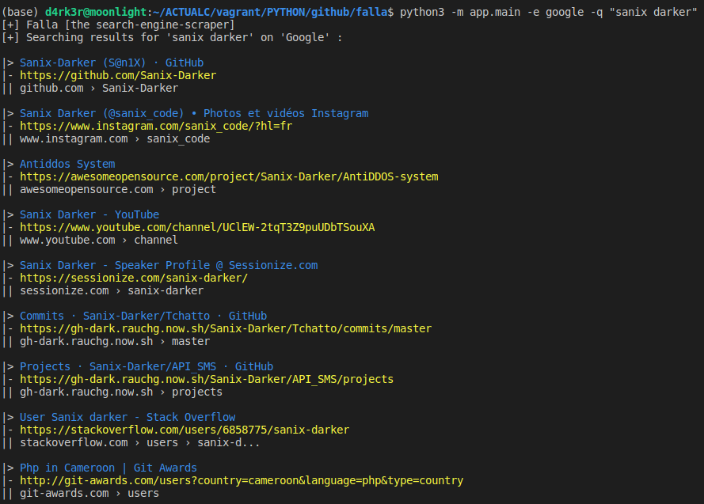

# Falla

A search-engine-cli-scraper for more than 15 search engines, including Google. duckduckgo, Bing, Ask, etc...

## Requirements
- Python (3.x)
- Pip3
- Docker (Not required for all search-engine)

## How to install

- You need to install all requirements :
```shell-script
pip3 install -r requirements.txt
```
- Install geckodriver :
```shell-script
# For linux users
# cd /home/your-user-name
wget https://github.com/mozilla/geckodriver/releases/download/v0.24.0/geckodriver-v0.24.0-linux64.tar.gz
tar -xvzf geckodriver*
chmod +x geckodriver
export PATH=$PATH:/path-to-extracted-file/.
```

- Pull and run the splash-scrap module (Some of search engine need this):
```shell-script
docker run -p 8050:8050 scrapinghub/splash
```

- Replace `example.config.txt` by `config.txt` and provide the running IP for the splash-scrap

## How to launch

How to use Falla:
```shell-script
usage: main.py [-h] [-e ENGINE] [-q QUERY]

optional arguments:
  -h, --help            show this help message and exit
  -e ENGINE, --engine ENGINE
                        The search engine
  -q QUERY, --query QUERY
                        The query text
```

- To list all search-engine:
```shell-script
$ python3 -m app.main
# output
[+] Falla [the search-engine-scraper]
[+] Listing search-Engines
[+] > google
[+] > bing
[+] > aol
[+] > dogpile
[+] > falla
[+] > ask
[+] > qwant
[+] > duckduckgo
[+] > mojeek
[+] > gibiru
[+] > yandex
[+] > yahoo
[+] > searchencrypt
[+] > iem
[+] > kallasearch
[+] > wosx
```

- To search something:
```shell-script
$ python3 -m app.main -e google -q "sanix darker"
# output
```

## Author

- Sanix-darker